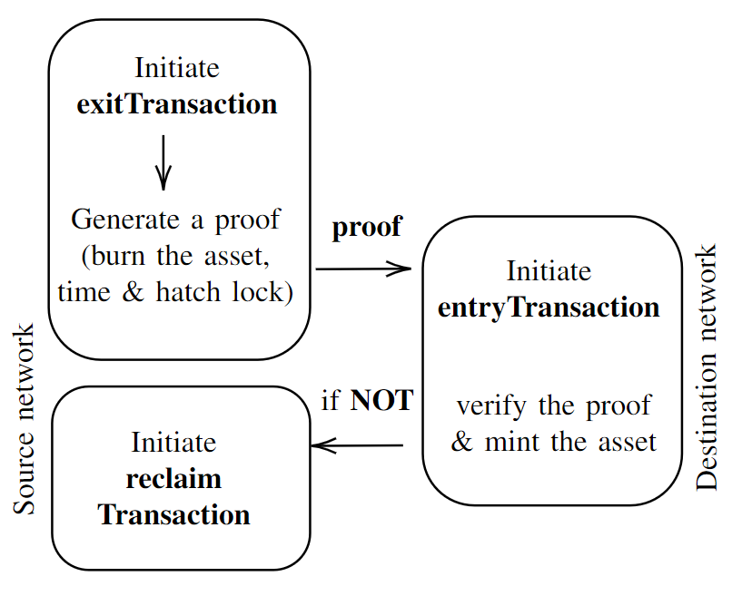

# burn-to-claim-formal-verification
## Implementation of paper Formal Verification of the Burn-to-Claim Protocol for Blockchain Interoperability based on PAT models. 
https://www.researchgate.net/publication/361388545_Formal_Verification_of_the_Burn-to-Claim_Protocol_for_Blockchain_Interoperability

At the very high level, we aim to construct a model that consists of a scenario where a user wishes to transfer an asset from a blockchain network to another blockchain network. The  [Burn-to-Claim](https://www.researchgate.net/publication/354880774_Burn-to-Claim_An_asset_transfer_protocol_for_blockchain_interoperability/). protocol executes the transfer process so that the asset is being destroyed (removed) from one blockchain network and re-created on the other blockchain network. The networks involved in this process are source networks from where the asset is removed and destination networks to where the asset is moved. The transfer process consists of two parts: first, the source network generates a self-verifiable transfer-proof, and second, the destination network regenerates the asset upon verifying the proof.

Above figure illustrates a brief overview of the transfer process with exitTransaction function that generates the transferProof and entryTransaction function} to verify the proof and regenerate the asset, demonstrating a cross-chain protocol workflow. The diagram represents the process and workflow involved in transferring value from one network to another.

